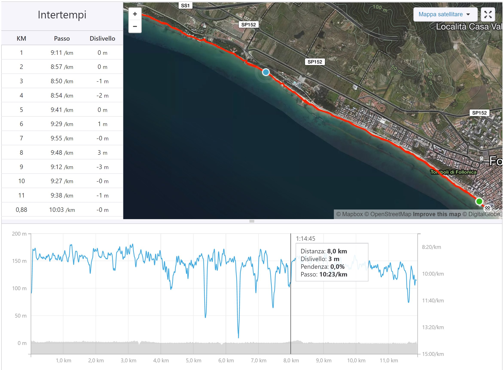

_"Come hai iniziato a correre?"_

Facendomi offendere. Siediti, che ti racconto.<!-- end -->

È la vigilia di Natale del 2016, una giornata splendida, piena di sole. Abito in riva al mare (letteralmente), il tempo e il luogo perfetti per uscire. Infatti sono saldamente piazzato sul divano, davanti alla [PS3](https://it.wikipedia.org/wiki/PlayStation_3). Peso **102kg x 172cm**, ho alle spalle un numero imprecisato di tessere della palestra appena scalfite e diete fallite con gli interessi.

Il programma è finire [God Of War](https://it.wikipedia.org/wiki/God_of_War:_Ascension) una volta per tutte: non avrò i muscoli e l'agilità di [Kratos](<https://it.wikipedia.org/wiki/Kratos_(God_of_War)>), ma ho un joypad per controllarlo e un numero a piacere di potenziali fallimenti, senza che le conseguenze debbano essere più gravi di un "riparti dall'ultimo salvataggio". Son pronto: la gioja è tale che prendo in mano il cellulare e, su Facebook, lo annuncio in pompa magna: _"il vs. avrà la meglio su mitici mostri di pixel mitologici, in una bella maratona di Playstation, AH BENE!"_

**_"Bravo coglione!"_** --mi risponde uno dei miei contatti. **_"Con una giornata così, invece di goderti l'aria e il mare... Va a farti una passeggiata, BRODO[^1] --te la meriti proprio la Pleistescion"_** (sic). Ecco, non ho ancora iniziato a giocare e già mi han fatto un culo considerevole.

A questo punto ho due scelte: me ne frego e premo _start_, oppure...

Oppure. _"Oppure mi vesto e vado a passeggiare sulla spiaggia"_, per la precisione-- un'epifania alla vigilia. Grazie Gesù che domani nasci, grazie _(obtorto collo)_ contatto di FB scortese ma sincero _(che magari domani muori, era molto obtorto il collo, eh)_. Grazie, ci son rimasto malino, però...

## Però vado

La pioggia caduta pochi giorni prima aveva reso il manto sabbioso compatto e facile da percorrere. Mi metto una tuta da ginnastica di [Decathlon](https://www.decathlon.it) e un paio di scarpe da Trekking vecchie di almeno 10 anni. Calzini di spugna e a completare il tutto un k-way grinzoso ma brutto. Decido di registrare quella prima camminata con [Strava](https://www.strava.com), un'app per cellulare che sapevo essere usata dagli "sportivi", tanto per avere un ricordo dell'ennesimo tentativo fallito di mettermi un po' in riga.

Succede una cosa strana: marcio a un ritmo abbastanza sostenuto, non certo una camminata rilassante. Eppure dopo 2, 3, addirittura 4 km, sento il bisogno di andare un po' più avanti, di spingermi oltre. Si intravede, in lontananza, quel posto meraviglioso che è [Torre Mozza](<https://it.wikipedia.org/wiki/Torre_Mozza_(Piombino)>), ma figurati se riuscirò ad arrivarci! _Mammeglio_[^2], Torre Mozza è fuori portata, piedi per terra, dai, ché fino a ieri eri parte integrante del divano. Non esageriamo.

## Però magari

...però magari faccio un'altra po' di strada. Arrivo fino a quello scoglio. Vabbè, scoglio raggiunto, già che ci sono posso arrivare al Club Nautico, è già una bella soddisfazione, dai _(occhio, poi devi tornare indietro eh? --zitto)_. Bon, arrivato anche al Club. Bella roba. Pensa te, ho fatto 4km, andata e ritorno diventeranno 8, mica male. Certo, Torre Mozza è davvero vicina, ora. Oddio, vicina, sembra vicina, ma magari poi mi prende un colpo e crollo, poi non ce la faccio a tornare, no dai. No.

## Sì, dai. Sì.

Devo anche attraversare una zona in cui la spiaggia è stata completamente erosa, aggrappandomi a un muretto e camminando in equilibrio precario sugli scogli, curioso granchio di circa un quintale. Ma arrivo a Torre Mozza. Stanco, ma non sfinito.

Tocco la torre in un gesto a metà tra lo scaramantico e il pionieristico (gesto a cui da quella volta non ho più saputo rinunciare) e torno subito indietro: ho paura che se mi fermo toccherà chiamare l'elisoccorso. Saranno le endorfine, ma faccio i 6km del ritorno a cuor leggero, sempre cercando la marcia serrata, non lasciando mai che il tutto diventi una semplice "passeggiata".

Così, tra l lusco e il brusco, completo il mio primo vero e proprio **_allenamento_**.

## Ancora! Ancora!

A casa, dopo una doverosa doccia, mi metto a riguardare la camminata registrata su Strava: _"Davvero ho fatto tutta quella strada? Oh, 12km sono roba eh? Torre Mozza! Pensa te. Quasi quasi la prossima settimana ci riprovo."_

Vabbè, ora però PlayStation, eh?

## Però torno

Dopo 4 giorni, ripeto lo stesso percorso. La volta dopo inverto la direzione e vado verso il porto di Scarlino. Bello, questa cosa mi prende, diventa un appuntamente regolare, a Follonica vedono spesso un ciccione ansimante vestito male che cammina spedito lungo la spiaggia, ascoltando la musica --e sorride, anche se gli fanno male le gambe, la schiena, tutto.

## Sì ma la corsa?

Per circa 3 mesi, non esiste. Mi limito a marciare, sulla spiaggia, in pineta, sull'asfalto: ritmo serrato, e via. Quando vedo passare i _runner_ penso: _"io non lo farò mai, non ho il fisico e comunque non ne vedo il fascino."_

Naturalmente mi sbaglio su tutto, tranne sul non avere (ancora) il fisico, infatti sono qui a scrivere: se avessi iniziato subito a correre mi sarei quasi di sicuro infortunato, perdendo ogni speranza e volontà di andare avanti. Ma di questo parleremo un'altra volta, ché ora devo allenarmi.

[^1]: _Brodo:_ termine maremmano atto a indicare persona di scarsa intelligenza e/o valore. Come _bischero_, ma peggio.
[^2]: _Mammeglio:_ termine maremmano per _"ma figurati, non ci pensare neanche"_.
